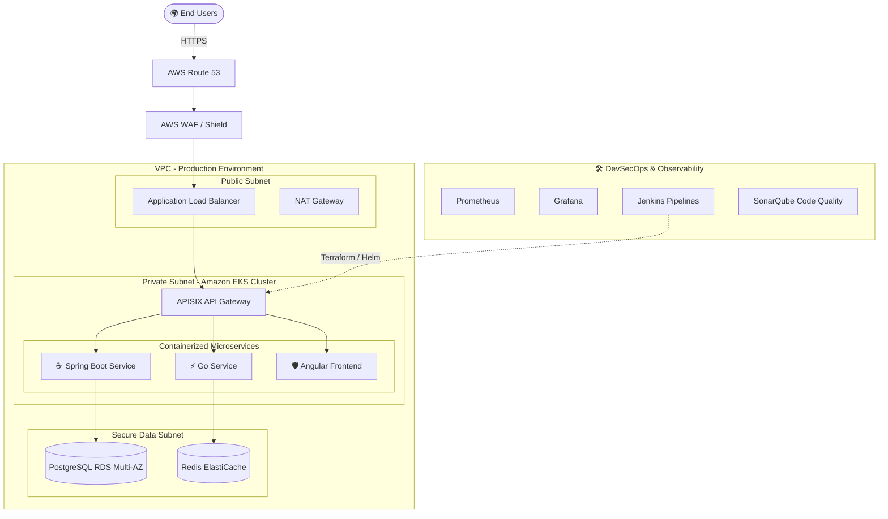

  

  <em>Designing highly-available architectures, secure CI/CD pipelines, and scalable cloud-native infrastructure.</em>

  
  
  
  

---

## 🚀 Engineering Impact

> **"Bridging the gap between development and operations through automation, observability, and robust infrastructure design."**

| 🎯 Key Competency | 💡 Business Impact |
|:---|:---|
| **Infrastructure as Code** | Reduced AWS operational costs by **40%** through Terraform automation and resource optimization. |
| **Release Engineering** | Accelerated delivery cycles by **90%** by engineering enterprise CI/CD pipelines for Java, Angular, and Go. |
| **Site Reliability** | Halved Incident MTTR (**↓ 50%**) by implementing comprehensive Prometheus + Grafana observability stacks. |
| **DevSecOps** | Decreased critical vulnerabilities by **30%** pre-deployment via automated Trivy, SonarQube, and OWASP ZAP gates. |

---

## 🧰 The DevOps Toolbox

<table align="center">
  <tr>
    <td align="center" width="25%">
      <h3>☁️ Cloud & Compute</h3>
       
       
      
    </td>
    <td align="center" width="25%">
      <h3>⎈ Containers</h3>
       
       
       
      
    </td>
    <td align="center" width="25%">
      <h3>🏗️ Infrastructure</h3>
       
       
       
      
    </td>
    <td align="center" width="25%">
      <h3>🔄 CI/CD & Delivery</h3>
       
       
       
      
    </td>
  </tr>
  <tr>
    <td align="center" width="25%">
      <h3>📊 Observability</h3>
       
       
       
      
    </td>
    <td align="center" width="25%">
      <h3>🛡️ Security</h3>
       
       
       
      
    </td>
    <td align="center" width="25%">
      <h3>🌐 Networking</h3>
       
       
       
      
    </td>
    <td align="center" width="25%">
      <h3>🗄️ Databases</h3>
       
       
      
    </td>
  </tr>
</table>

---

## 📐 Enterprise Architecture Showcase

*As a Cloud Engineer, I specialize in designing scalable, secure, and highly available architectures. Here is a conceptual EKS microservices deployment model:*

---

## 📜 Active Certifications
- ☁️ **AWS Certified Cloud Practitioner (CLF-C01)** — *Amazon Web Services, 2022*
- 🎓 **Masters Program in AWS Cloud Architect** — *Simplilearn, 2022*

---

## 📈 GitHub Analytics

  
  

 

  <em>Always open to discussing Cloud Architecture, Kubernetes, and DevOps best practices!</em>

